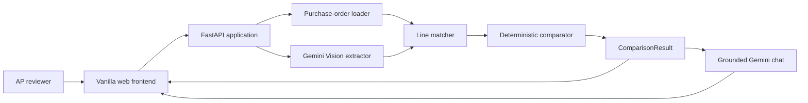

# AP Invoice Exception Assistant

An AI-assisted accounts payable workspace for comparing vendor invoices with purchase orders. Upload an invoice, select a purchase order, and review extracted line items, deterministic mismatch findings, source-field explanations, and grounded chat responses.

## Contents

- [What It Does](#what-it-does)
- [Architecture](#architecture)
- [Comparison Flow](#comparison-flow)
- [Project Structure](#project-structure)
- [Requirements](#requirements)
- [Quick Start](#quick-start)
- [Using the Application](#using-the-application)
- [API Reference](#api-reference)
- [Testing](#testing)
- [Configuration and Security](#configuration-and-security)
- [Design Decisions](#design-decisions)

## What It Does

The assistant supports the invoice review workflow from document upload through exception analysis:

1. Loads sample purchase orders and invoice files for a quick demonstration.
2. Extracts invoice fields and line items from PDF or image files with Gemini Vision.
3. Matches invoice lines to purchase-order lines by item code, then by fuzzy description similarity.
4. Detects price, quantity, subtotal, tax, total, and unmatched-line differences with deterministic Python rules.
5. Displays the original document, extracted values, comparison table, exception severity, and source-field evidence.
6. Answers reviewer questions using the latest comparison as grounded context.

The frontend is a no-build vanilla HTML, CSS, and JavaScript application served by FastAPI.

## Architecture



### Responsibility Boundaries

| Layer             | Responsibility                                                                             |
| ----------------- | ------------------------------------------------------------------------------------------ |
| Frontend          | Upload and selection controls, previews, results dashboard, exception details, and chat UI |
| `backend/main.py` | FastAPI routes, request validation, static-file serving, and latest comparison state       |
| Extractor         | Sends invoice PDF/image content to Gemini Vision and validates structured output           |
| Matcher           | Pairs invoice lines with purchase-order lines using item codes and fuzzy descriptions      |
| Comparator        | Applies business rules and creates deterministic mismatch explanations                     |
| Chat engine       | Sends the comparison context and reviewer question to Gemini for source-grounded answers   |
| Pydantic schemas  | Defines and validates the data contract between services and API responses                 |

## Comparison Flow

```text
Invoice PDF/image + purchase-order JSON
                |
                v
     Gemini Vision extraction
                |
                v
       Validated invoice model
                |
                v
       Two-pass line matching
        1. Exact item code
        2. Fuzzy description
                |
                v
     Deterministic comparison rules
                |
                v
 ComparisonResult with evidence
                |
                +--> Dashboard and exception cards
                |
                +--> Grounded reviewer chat
```

## Project Structure

```text
AP Invoice/
├── backend/
│   ├── main.py                 # FastAPI app, API routes, and frontend hosting
│   ├── requirements.txt        # Python dependencies
│   ├── .env.example             # Environment-variable template
│   ├── generate_invoices.py     # Generates sample invoice documents
│   ├── models/
│   │   ├── __init__.py
│   │   └── schemas.py           # Pydantic request and response models
│   ├── services/
│   │   ├── chat_engine.py       # Gemini-powered grounded chat
│   │   ├── comparator.py        # Mismatch rules and explanations
│   │   ├── extractor.py         # Gemini Vision extraction
│   │   └── matcher.py           # Invoice/PO line matching
│   ├── sample_data/
│   │   ├── po_001.json          # Sample purchase order
│   │   ├── po_002.json          # Sample purchase order
│   │   ├── invoice_001.*        # Sample invoice with exceptions
│   │   └── invoice_002.*        # Sample invoice with exceptions
│   └── tests/
│       └── test_comparator.py   # Comparator unit tests
├── frontend/
│   ├── index.html               # Application shell
│   ├── styles.css               # Visual design system
│   └── app.js                   # Browser-side application logic
├── scratch/                     # Local design and rewrite utilities
├── update_styles.py             # Style update helper
├── .gitignore                   # Local files excluded from Git
└── README.md
```

## Requirements

- Python 3.11 or newer
- A Google Gemini API key for invoice extraction and chat
- A modern browser with JavaScript enabled

## Quick Start

From the project root:

```bash
# Create and activate a virtual environment (recommended)
python -m venv .venv
\.venv\Scripts\activate       # Windows PowerShell
# source .venv/bin/activate    # macOS/Linux

# Install dependencies
python -m pip install -r backend/requirements.txt

# Configure Gemini
copy backend\.env.example backend\.env    # Windows
# cp backend/.env.example backend/.env      # macOS/Linux
# Edit backend/.env and set GEMINI_API_KEY

# Generate or refresh sample invoice files when needed
python backend/generate_invoices.py

# Start the application
python -m uvicorn backend.main:app --host 0.0.0.0 --port 8000 --reload
```

Open [http://localhost:8000](http://localhost:8000). Interactive API documentation is available at [http://localhost:8000/docs](http://localhost:8000/docs).

## Deploy to Render

The repository includes [`render.yaml`](render.yaml), which defines the web service, build command, start command, health check, and Gemini secret.

1. Create or sign in to a [Render](https://render.com) account.
2. Select **New > Blueprint** and connect the GitHub repository `Vasanthi1723/AP_Invoice_Exception_Assistant`.
3. Confirm that Render detects `render.yaml` and creates the `ap-invoice-exception-assistant` web service.
4. Add the `GEMINI_API_KEY` environment variable when Render prompts for it. Use the value from Google AI Studio; do not put the key in GitHub.
5. Select **Apply**. Render installs `backend/requirements.txt`, starts Uvicorn on Render's `$PORT`, and checks `/api/health`.
6. Open the generated `https://...onrender.com` URL after the first deploy finishes.

The free Render service may sleep when idle, so the first request after inactivity can take longer. The application currently stores only the latest comparison in memory and allows unrestricted CORS for local development; add authentication, persistent storage, upload limits, and a restricted CORS policy before using it with real invoices.

## Using the Application

1. Start the FastAPI server.
2. Choose a sample invoice or upload a PDF, PNG, JPG, or WebP invoice.
3. Select a sample purchase order.
4. Choose **Analyze Invoice**.
5. Review the summary, source document, extracted data, matched lines, and exceptions.
6. Open the chat panel to ask questions about the current comparison.

Invoice uploads are limited to 20 MB in the browser. A Gemini API key is required when the backend extracts an invoice from a document. The comparison endpoint also accepts pre-extracted invoice JSON for integrations and controlled demo use.

## API Reference

| Method | Endpoint                          | Purpose                                                                |
| ------ | --------------------------------- | ---------------------------------------------------------------------- |
| `GET`  | `/`                               | Serves the frontend application                                        |
| `GET`  | `/api/health`                     | Returns service status and Gemini configuration status                 |
| `GET`  | `/api/sample-pos`                 | Lists available sample purchase orders                                 |
| `GET`  | `/api/sample-pos/{filename}`      | Returns one sample purchase order                                      |
| `GET`  | `/api/sample-invoices`            | Lists available sample invoice files                                   |
| `GET`  | `/api/sample-invoices/{filename}` | Serves one sample invoice file                                         |
| `POST` | `/api/compare`                    | Extracts or accepts invoice data and compares it with a purchase order |
| `POST` | `/api/chat`                       | Answers a question using the latest comparison context                 |

FastAPI also exposes the generated OpenAPI schema at `/openapi.json` and Swagger UI at `/docs`.

### Compare Request Inputs

`POST /api/compare` accepts multipart form data with:

- `invoice_file`: uploaded PDF or image, or
- `invoice_json`: pre-extracted invoice JSON,
- `po_file`: uploaded purchase-order JSON, or
- `po_filename`: a filename from `backend/sample_data`.

Use exactly one invoice input and one purchase-order input.

## Testing

Run the comparator tests from the project root:

```bash
python -m pytest backend/tests/ -v
```

The test suite focuses on deterministic comparison behavior, including price, quantity, tax, total, and matching-related exceptions.

## Configuration and Security

Set the key in `backend/.env`:

```dotenv
GEMINI_API_KEY=your_gemini_api_key_here
```

Never commit `backend/.env` or expose the API key in frontend code. The repository ignores local environment files, Python caches, virtual environments, and generated test caches. For production use, add authentication, persistent storage, request limits, structured audit logging, and a restricted CORS policy before deploying publicly.

## Design Decisions

- **Deterministic exception detection:** mismatch flags are produced by Python business rules rather than an LLM, making results reproducible and auditable.
- **Source-grounded explanations:** exception details cite the relevant purchase-order and invoice fields and values.
- **Two-pass matching:** exact item-code matching is preferred; fuzzy description matching handles small naming differences.
- **Stateless demo storage:** the latest comparison is held in memory for a simple single-session workflow. It is not a multi-user persistence layer.
- **FastAPI-served frontend:** the browser app has no separate build step, which keeps local setup small and makes the API/frontend contract easy to inspect.

## Technology Stack

- **Backend:** Python, FastAPI, Uvicorn, Pydantic
- **AI:** Google Gemini SDK, Gemini Vision, grounded text chat
- **Documents:** PyMuPDF for PDF handling
- **Matching:** `thefuzz`
- **Frontend:** HTML, CSS, vanilla JavaScript, Lucide icons
- **Testing:** Pytest
